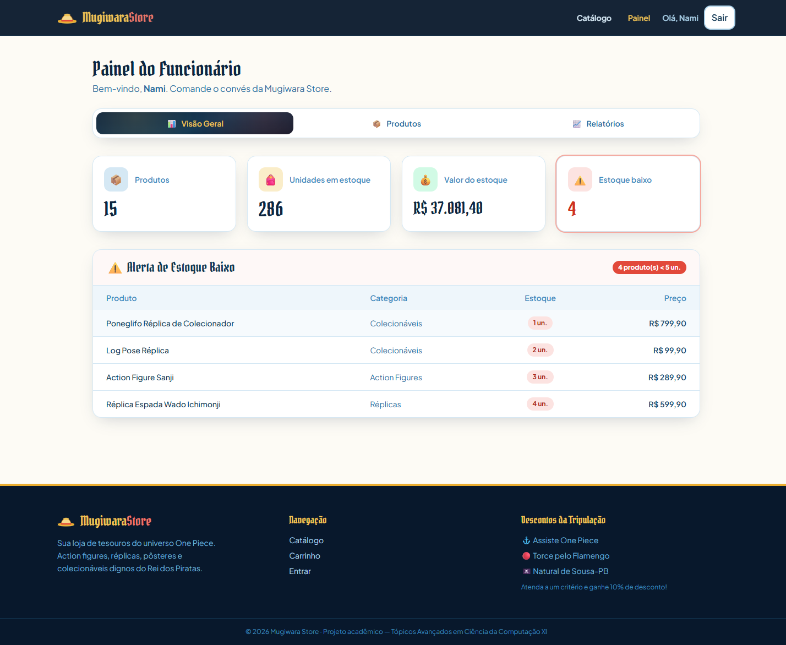
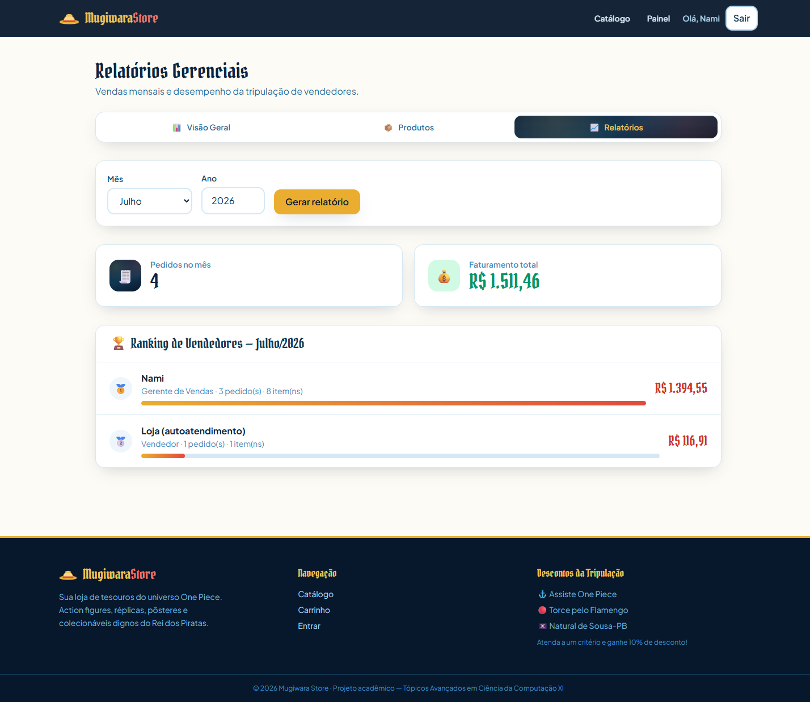

<div align="center">

# 🏴‍☠️ Mugiwara Store

### E-commerce temático do universo **One Piece**

Aplicação CRUD full-stack desenvolvida para a disciplina
**Tópicos Avançados em Ciência da Computação XI — Programação com Agentes**
(Atividades 03 e 04)

**Grupo:** Deivily · Deivison · Giancarlo

    

</div>

---

## 📖 Sobre

A **Mugiwara Store** é uma plataforma de e-commerce de nicho dedicada à venda de
colecionáveis, *action figures*, réplicas, pôsteres e vestuário inspirados na obra
*One Piece*. Clientes navegam pelo catálogo, montam um carrinho e finalizam pedidos;
funcionários gerenciam o estoque, cadastram produtos e acompanham relatórios de vendas.

A aplicação implementa as **quatro operações CRUD** sobre as entidades do domínio, além
de regras de negócio como **controle de estoque em tempo real**, **política de descontos
por perfil do cliente** e **relatórios gerenciais**.

## 🖼️ Telas

| Catálogo (Home) | Painel do Funcionário | Relatórios Gerenciais |
|:---:|:---:|:---:|
|  |  |  |

## 🧱 Arquitetura

Arquitetura em **três camadas**, totalmente conteinerizada:

```
┌──────────────┐     HTTP/JSON     ┌──────────────┐      SQL       ┌──────────────┐
│   Frontend   │  ───────────────► │   Backend    │ ─────────────► │  PostgreSQL  │
│ Vue 3 + Vite │  ◄─────────────── │   FastAPI    │ ◄───────────── │      16      │
│  (Nginx :80) │                   │    (:8000)   │                │   (:5432)    │
└──────────────┘                   └──────────────┘                └──────────────┘
     :8080                       Routers → Services →              tabelas + VIEW
                                 Repositories → Models             + PROCEDURE
```

O backend segue o padrão em camadas planejado na Atividade 03:
**Routers → Services (regras de negócio) → Repositories (acesso a dados) → Models (ORM)**.

### Stack tecnológica

| Camada | Tecnologia |
|---|---|
| Frontend | Vue 3 + Vite + TypeScript + Tailwind CSS + Pinia |
| Backend | FastAPI (Python 3.12) + Pydantic v2 |
| ORM | SQLAlchemy 2.0 |
| Banco | PostgreSQL 16 (com VIEW e stored PROCEDURE) |
| Autenticação | JWT (python-jose) + OAuth2 + bcrypt |
| Testes | pytest + FastAPI TestClient |
| Infra | Docker + Docker Compose + Nginx |

## 🚀 Como executar

### Pré-requisitos
- [Docker](https://www.docker.com/) e Docker Compose

### Passos

```bash
# 1. Copie o arquivo de ambiente
cp .env.example .env

# 2. Suba toda a stack (banco + API + web)
docker compose up -d --build

# 3. Acesse:
#    Frontend .............. http://localhost:8080
#    API (Swagger docs) .... http://localhost:8000/docs
#    Banco (PostgreSQL) .... localhost:5432
```

O banco é inicializado automaticamente com o **schema completo** (`backend/db/init.sql`)
e **dados de demonstração** (`backend/db/seed.sql`).

Para parar: `docker compose down` (ou `docker compose down -v` para apagar também os volumes).

### 🔑 Contas de demonstração

> Senha de **todos** os usuários: `senha123`

| Perfil | E-mail | Observação |
|---|---|---|
| 👔 Funcionário | `nami@mugiwara.com` | Gerente de Vendas (painel + relatórios) |
| 👔 Funcionário | `franky@mugiwara.com` | Vendedor |
| 🧑 Cliente | `luffy@mugiwara.com` | Elegível a desconto (assiste One Piece + Sousa-PB) |
| 🧑 Cliente | `robin@mugiwara.com` | Elegível a desconto (torce Flamengo) |
| 🧑 Cliente | `buggy@mugiwara.com` | Sem desconto |

## ✅ Testes

Testes automatizados com **pytest** cobrem os critérios de validação **CV-01 a CV-08**
e de aceitação **CA-01 a CA-06** (validados via API, sem necessidade de servidor externo —
usam SQLite em memória).

```bash
cd backend
python -m venv .venv && source .venv/Scripts/activate   # (Windows Git Bash)
pip install -r requirements.txt
python -m pytest
# => 24 passed
```

## 🗂️ Funcionalidades

- **Catálogo público** — navegação, busca por nome, filtro por categoria e faixa de preço (sem login)
- **Autenticação** — cadastro de cliente (com endereço via CEP/ViaCEP) e login para 2 perfis
- **CRUD de produtos** — criação, edição e remoção por funcionários, com **upload de imagem** (arquivo local ou URL)
- **Carrinho e checkout** — validação de estoque em tempo real e finalização de pedido
- **Política de descontos** — 10% para clientes que assistem One Piece, torcem pelo Flamengo ou são de Sousa-PB
- **Histórico de pedidos** — cliente consulta seus pedidos com itens, valores e status
- **Painel do funcionário** — KPIs de estoque + alerta de estoque baixo (< 5 un.)
- **Relatórios gerenciais** — resumo de estoque e ranking mensal de vendas por vendedor

## 🧩 Objetos de banco em destaque

- **VIEW `vw_vendas_por_vendedor`** — consolida `PEDIDO + FUNCIONARIO + ITEM_PEDIDO + PRODUTO` para os relatórios.
- **PROCEDURE `criar_pedido_completo`** — transação atômica que valida estoque, aplica desconto,
  insere pedido e itens e baixa o estoque (a mesma lógica é replicada na camada de serviço do backend,
  usada pela API e testada automaticamente).

## 📁 Estrutura do projeto

```
mugiwara-store/
├── docker-compose.yml          # Orquestração dos 3 serviços
├── .env.example                # Variáveis de ambiente
├── RELATORIO.md                # Relatório do projeto (Atividade 04)
├── backend/
│   ├── Dockerfile
│   ├── requirements.txt
│   ├── db/
│   │   ├── init.sql            # Schema: tabelas, constraints, VIEW, PROCEDURE
│   │   └── seed.sql            # Dados de demonstração
│   ├── app/
│   │   ├── main.py            # Entrypoint FastAPI
│   │   ├── core/             # config, database, security, exceptions
│   │   ├── models/          # SQLAlchemy 2.0
│   │   ├── schemas/         # Pydantic v2
│   │   ├── repositories/   # Acesso a dados
│   │   ├── services/       # Regras de negócio
│   │   └── routers/        # Endpoints REST
│   └── tests/               # pytest (24 testes)
└── frontend/
    ├── Dockerfile             # Multi-stage (build Vue → Nginx)
    ├── nginx.conf
    └── src/
        ├── components/       # Navbar, Footer, ProductCard, ...
        ├── views/            # Home, Cart, Login, Admin, ...
        ├── stores/           # Pinia (auth, cart, toast)
        ├── router/
        └── api/              # Cliente Axios
```

## 🔌 Principais endpoints da API

| Método | Rota | Acesso | Descrição |
|---|---|---|---|
| `GET` | `/api/produtos` | público | Lista/busca/filtra produtos |
| `POST` | `/api/produtos` | funcionário | Cria produto |
| `PUT` | `/api/produtos/{id}` | funcionário | Edita produto |
| `DELETE` | `/api/produtos/{id}` | funcionário | Remove produto |
| `POST` | `/api/auth/register` | público | Cadastro de cliente |
| `POST` | `/api/auth/login` | público | Login (JWT) |
| `POST` | `/api/pedidos` | cliente | Finaliza compra |
| `GET` | `/api/pedidos/meus` | cliente | Histórico de pedidos |
| `POST` | `/api/uploads/imagem` | funcionário | Upload de imagem |
| `GET` | `/api/relatorios/estoque-baixo` | funcionário | Produtos com estoque < 5 |
| `GET` | `/api/relatorios/vendas` | funcionário | Relatório mensal de vendas |

> Documentação interativa completa em **http://localhost:8000/docs** (Swagger UI).

---

<div align="center">
Projeto acadêmico · 2026 · Feito com o auxílio de agentes de IA 🤖
</div>
